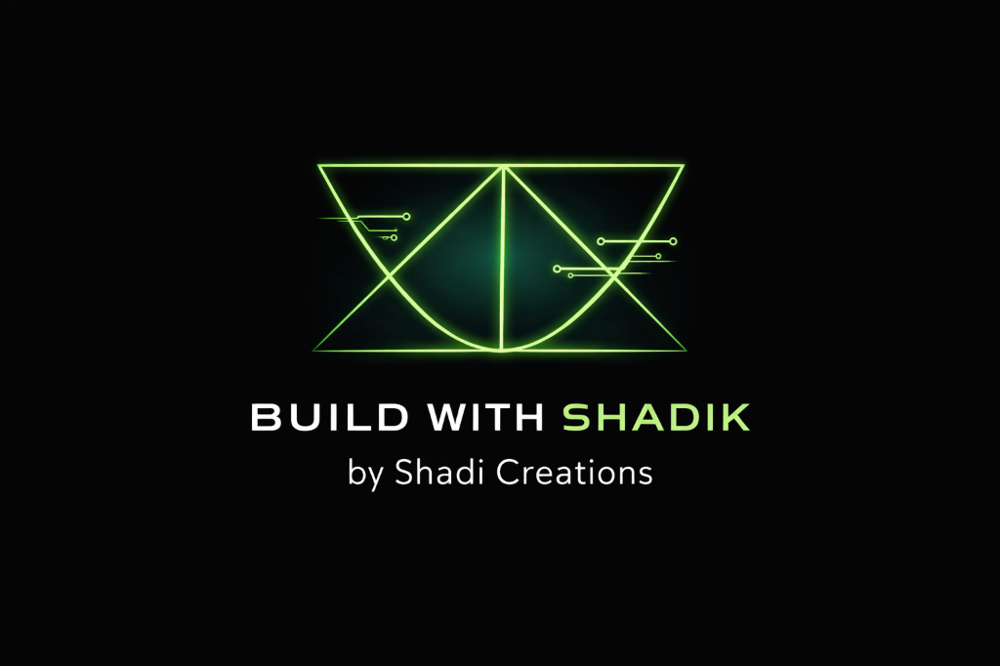
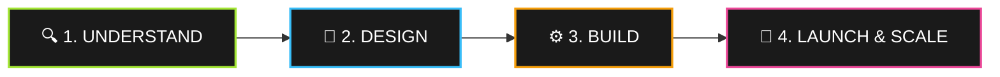

<div align="center">



# <span style="color:#a3e635">⚡ BUILD WITH SHADIK</span>
### 🚀 Next-Gen AI & Digital Solutions Agency · *by Shadi Creations*

```
⚡ Websites.   ✦ AI Automation.   🤖 Chatbots.   🎙️ Voice Agents.   📈 Real Growth.
```

<p align="center">
  <a href="https://wa.me/918309432965?text=Hi%20Shaik%2C%20I%20found%20BuildWithShadik%20and%20would%20like%20to%20discuss%20a%20project!">
    
  </a>
  <a href="mailto:shaikshadik003@gmail.com">
    
  </a>
  <a href="tel:+918309432965">
    
  </a>
  
</p>

<p align="center">
  
  
  
  
  
  
</p>

---

### 🌟 *"Practical digital intelligence built around your real business operations."*

</div>

<br/>

<div align="center">

| 📍 **Base Location** | 👤 **Founder** | 💼 **Parent Studio** | ⚡ **Core Focus** |
| :--- | :--- | :--- | :--- |
| **Maisammaguda, Hyderabad, TS, India** | **Shaik Shadik** | **Shadi Creations** | **AI Systems & Websites** |

</div>

---

## 🎯 About The Agency

> **BuildWithShadik** is a specialized modern AI and digital systems agency based out of Hyderabad. We help local enterprises, service businesses, and modern brands replace messy manual workflows with intelligent systems, modern high-converting websites, WhatsApp communication automation, and AI client support agents.

```
       ┌────────────────────────┐
       │   YOUR BUSINESS IDEA   │
       └───────────┬────────────┘
                   ▼
┌───────────────────────────────────────┐
│     BUILD WITH SHADIK ECOSYSTEM       │
│  Websites · Chatbots · Automation     │
└──────────────────┬────────────────────┘
                   ▼
       ┌────────────────────────┐
       │ STREAMLINED REVENUE 🚀 │
       └────────────────────────┘
```

---

## 💎 What We Build (Our 8 Core Services)

<table>
  <tr>
    <td width="50%" valign="top">
      <h3>🟢 01. WhatsApp Business Setup</h3>
      <p><b>Badge:</b> <code>NO CODING REQUIRED</code> <code>MESSAGING</code></p>
      <p>Transform your WhatsApp into an automated sales and communication machine.</p>
      <ul>
        <li>✅ Verified business profile & branded catalog</li>
        <li>✅ Instant automated welcome & out-of-office sequences</li>
        <li>✅ Customized quick-reply templates & customer labels</li>
        <li>✅ 1-click WhatsApp web enquiry integrations</li>
      </ul>
      <p><i>🎯 Ideal for: Retail stores, restaurants, service clinics, and local shops.</i></p>
    </td>
    <td width="50%" valign="top">
      <h3>🟣 02. AI-Generated Visuals & Photos</h3>
      <p><b>Badge:</b> <code>CREATIVE AI</code> <code>CONTENT</code></p>
      <p>High-end studio-grade product and social branding imagery without costly photographers.</p>
      <ul>
        <li>🎨 Photorealistic product backgrounds and lifestyle shoots</li>
        <li>🎨 Social media marketing assets & banner campaigns</li>
        <li>🎨 Brand identity graphics & promotional artwork</li>
        <li>🎨 Multi-aspect ratio delivery (Instagram, Web, Ads)</li>
      </ul>
      <p><i>🎯 Ideal for: D2C brands, creators, cafes, fashion, and modern startups.</i></p>
    </td>
  </tr>
  <tr>
    <td width="50%" valign="top">
      <h3>🔵 03. High-Converting Business Websites</h3>
      <p><b>Badge:</b> <code>RESPONSIVE</code> <code>PERFORMANCE</code></p>
      <p>Ultra-clean, lightning-fast digital storefronts engineered around customer acquisition.</p>
      <ul>
        <li>💻 Sleek dark & light aesthetic with glassmorphism touches</li>
        <li>💻 Fully mobile, tablet, and desktop responsive (100% fluid)</li>
        <li>💻 One-tap WhatsApp chat CTA & lead contact forms</li>
        <li>💻 SEO optimized metadata & Google schema readiness</li>
      </ul>
      <p><i>🎯 Ideal for: Any business wanting a credible, high-end online presence.</i></p>
    </td>
    <td width="50%" valign="top">
      <h3>🟡 04. Intelligent AI Chatbots</h3>
      <p><b>Badge:</b> <code>AI POWERED</code> <code>24/7 SUPPORT</code></p>
      <p>Interactive on-site virtual agents that answer visitor questions and qualify leads round the clock.</p>
      <ul>
        <li>🤖 Custom-trained on your exact pricing, FAQs, and services</li>
        <li>🤖 Automated lead qualification and contact gathering</li>
        <li>🤖 Intelligent fallback to human WhatsApp handoff</li>
        <li>🤖 Local rule engine + API ready (OpenAI / Claude / Gemini)</li>
      </ul>
      <p><i>🎯 Ideal for: Real estate, education, clinics, and customer-heavy websites.</i></p>
    </td>
  </tr>
  <tr>
    <td width="50%" valign="top">
      <h3>🟠 05. Inbox & WhatsApp Automation</h3>
      <p><b>Badge:</b> <code>AUTOMATION</code> <code>N8N / MAKE</code></p>
      <p>Eliminate repetitive admin work by auto-routing enquiries and syncing notifications.</p>
      <ul>
        <li>⚡ Instant lead alert notifications to owner's phone</li>
        <li>⚡ Automated follow-up messages for missed leads</li>
        <li>⚡ Integration with webhooks, Google Sheets, and CRMs</li>
        <li>⚡ Multi-channel sync across form submissions and WhatsApp</li>
      </ul>
      <p><i>🎯 Ideal for: Busy founders and teams spending hours answering repetitive messages.</i></p>
    </td>
    <td width="50%" valign="top">
      <h3>🔴 06. AI Voice Agents</h3>
      <p><b>Badge:</b> <code>VOICE AI</code> <code>TELEPHONY</code></p>
      <p>Interactive voice systems capable of handling telephone enquiries naturally.</p>
      <ul>
        <li>🎙️ Human-like conversational voice synthesis & understanding</li>
        <li>🎙️ Inbound query answering and service guidance</li>
        <li>🎙️ Automated phone lead qualification and call scheduling</li>
        <li>🎙️ Direct CRM data logging from phone calls</li>
      </ul>
      <p><i>🎯 Ideal for: Service businesses with heavy inbound calls & appointment lines.</i></p>
    </td>
  </tr>
  <tr>
    <td width="50%" valign="top">
      <h3>🟢 07. AI Appointment Booking Systems</h3>
      <p><b>Badge:</b> <code>BOOKING</code> <code>CALENDAR</code></p>
      <p>Frictionless online scheduling that fills your calendar automatically without back-and-forth emails.</p>
      <ul>
        <li>📅 Interactive real-time slot selection</li>
        <li>📅 Automated instant WhatsApp & email confirmations</li>
        <li>📅 Smart reminder alerts to prevent customer no-shows</li>
        <li>📅 Seamless payment gateway integration readiness</li>
      </ul>
      <p><i>🎯 Ideal for: Salons, doctors, consultants, coaches, and fitness studios.</i></p>
    </td>
    <td width="50%" valign="top">
      <h3>🔵 08. Maps & Local Growth Optimization</h3>
      <p><b>Badge:</b> <code>LOCAL SEO</code> <code>GEO TARGETING</code></p>
      <p>Dominate local Google Search and Google Maps rankings when nearby customers look for you.</p>
      <ul>
        <li>📍 Google Business Profile (GBP) complete setup & ranking push</li>
        <li>📍 Automated review collection system via WhatsApp links</li>
        <li>📍 Local citation synchronization and map geotagging</li>
        <li>📍 High-converting local search description & call-buttons</li>
      </ul>
      <p><i>🎯 Ideal for: Local retail shops, service centers, clinics, and dining spots.</i></p>
    </td>
  </tr>
</table>

---

## ⚡ The Client Experience Workflow



| Phase | Milestone | Execution Deliverable |
| :---: | :--- | :--- |
| **01** | **Discovery & Strategy** | We assess your customer path, existing tools, and bottlenecks. |
| **02** | **Design & Architecture** | Wireframing sleek dark-mode UI, copy drafting, and workflow logic maps. |
| **03** | **Engineering & AI Link** | Frontend coding, connecting WhatsApp bots, forms, and triggers. |
| **04** | **Deployment & Growth** | Domain launch, Google Maps verification, handover training & ongoing support. |

---

## 🖥️ Website Architecture & Codebase

The website built in this repository is designed as a **senior-level production React codebase**:

```
buildwithshadik/
├── 📂 public/
│   ├── 📂 brand/
│   │   ├── 🖼️ logo.png           <-- Official neon green & white brand logo
│   │   ├── 🖼️ favicon.png        <-- Crisp agency browser icon
│   │   └── 📄 README.md
├── 📂 src/
│   ├── 📂 components/
│   │   ├── 🧩 Navbar.tsx         <-- Sticky blur glassmorphism, responsive menu
│   │   ├── 🧩 Hero.tsx           <-- 520px watermark backdrop + floating animated cards
│   │   ├── 🧩 Services.tsx       <-- 8 responsive cards with glow micro-interactions
│   │   ├── 🧩 AIExperience.tsx   <-- Live customer-to-appointment dashboard preview
│   │   ├── 🧩 Portfolio.tsx      <-- 4 verified DEMO projects for clients
│   │   ├── 🧩 Process.tsx        <-- Interactive timeline (horizontal / vertical)
│   │   ├── 🧩 WhyUs.tsx          <-- 4 value proposition cards
│   │   ├── 🧩 About.tsx          <-- Founder bio + Shadi Creations credentials
│   │   ├── 🧩 FAQ.tsx            <-- Accessible animated accordion
│   │   ├── 🧩 Contact.tsx        <-- Dynamic multi-service inquiry form + validator
│   │   ├── 🧩 CTA.tsx            <-- High-impact conversion section
│   │   ├── 🧩 Footer.tsx         <-- 4-column structured agency footer
│   │   ├── 🤖 Chatbot.tsx        <-- Complete floating AI assistant widget
│   │   └── 💬 WhatsAppButton.tsx <-- Direct floating WhatsApp trigger
│   ├── 📂 data/
│   │   ├── 📊 services.ts        <-- Clean decoupled service content
│   │   ├── 📊 portfolio.ts       <-- Portfolio mock entries
│   │   └── 📊 faq.ts             <-- Searchable agency FAQ
│   ├── 📂 services/
│   │   ├── ⚙️ chatbotService.ts   <-- Decoupled AI engine (OpenAI / Claude / Gemini ready)
│   │   └── ⚙️ whatsappService.ts  <-- Instant deep-link formatter
│   ├── 🎨 index.css              <-- Tailwind v4 @theme configuration & custom glass
│   ├── 🎨 globals.css            <-- Micro-keyframes & accessibility resets
│   └── 🚀 App.tsx                <-- Central composition engine
```

---

## 🛠️ Quickstart Local Setup

```bash
# 1. Clone repository
git clone https://github.com/Shaikshadik03/BuildWithShadik-Ai-Agency.git

# 2. Enter project folder
cd BuildWithShadik-Ai-Agency

# 3. Install packages
npm install

# 4. Fire up the local dev server
npm run dev

# 5. Build for production
npm run build
```

---

## 🌐 Roadmap & Integrations

- [x] **Core Website V1.0** — Responsive dark-mode studio aesthetic
- [x] **Brand Assets Integrated** — Custom geometric neon logo watermark & favicon
- [x] **Interactive Chat Assistant** — Configured with multi-topic answers & quick-replies
- [x] **WhatsApp Deep-Link Automation** — Prefilled customer inquiry triggers
- [ ] **Supabase Backend** — Connect live contact form storage & lead alerts
- [ ] **LLM API Handoff** — Swap mock response engine with OpenAI / Gemini live keys
- [ ] **n8n / Make Webhook Triggers** — Auto-route form submissions to WhatsApp instantly
- [ ] **Live Client Case Studies** — Replace demo tags with verified client outcomes

---

## 📬 Connect With Shaik Shadik

<div align="center">

<p>
Ready to build your digital presence or automate your business operations? Let's have a conversation.
</p>

### 👤 **Shaik Shadik**
**Founder · BuildWithShadik**  
*A Venture by Shadi Creations*

<p align="center">
  <a href="https://wa.me/918309432965?text=Hi%20Shaik%2C%20I%20found%20BuildWithShadik%20and%20would%20like%20to%20know%20more!">
    
  </a>
  <a href="mailto:shaikshadik003@gmail.com">
    
  </a>
</p>

```
📍 Headquarters: Maisammaguda, Hyderabad, Telangana, India
⏰ Response Time: Usually within 1-2 hours
```

---

<p style="color:#a3e635;"><b>© 2026 BuildWithShadik · by Shadi Creations. All rights reserved.</b></p>
<p><i>Building modern digital tools for modern businesses.</i></p>

</div>
